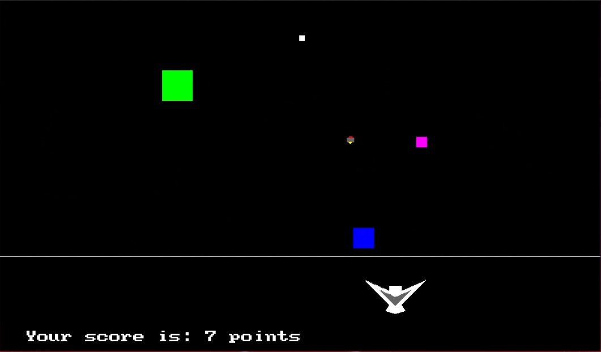

# Space evaders
Shoot 'em if you can 🤠

This code is for a game written in C, using SDL library that I'm making as a uni project.

To play, build the binary with provided [makefile](current_version/makefile) and run it. Requires SDL2 library.
